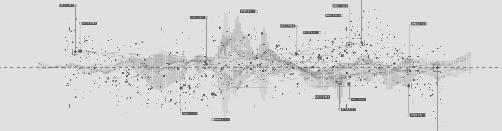

## Hi there 👋

Hello! 👋 I am Themis, a dedicated and highly analytical professional with a strong background in mathematics, statistics, and data analysis. With ten years of experience in the field of education, I specialize in teaching mathematics, statistics, programming (primarily Python), and data analysis for scientific research. I have strong data management and statistical skills and am proficient in Python, R, and SQL. Currently, I am building my portfolio, studying machine learning, and I am looking forward to joining a professional and diverse team focused on applying machine learning to automate decision-making processes.

## Skills

- **Programming Languages:** Python, R, SQL
- **Data Analysis & Management:** Statistical analysis, data visualization, data cleaning
- **Machine Learning:** Currently studying and building a portfolio in this area

## Projects

You can take a look at my [porfolio](https://themispap.github.io/)

## 

Feel free to explore my repositories and connect with me on [LinkedIn](https://www.linkedin.com/in/papavramidisthemis/) or via email at [papavramidis.themis@gmail.com](mailto:papavramidis.themis@gmail.com). I am always open to discussing new opportunities and collaborations.

_Thank you for visiting my profile!_

